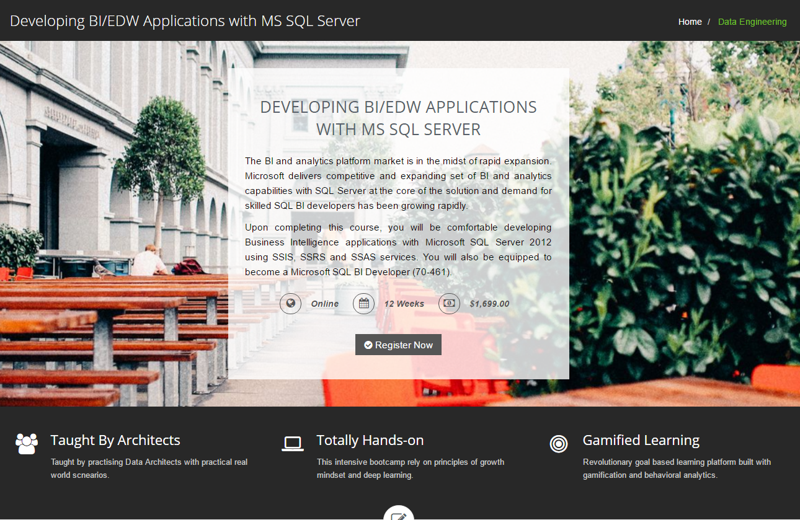

# DEVELOPING BI/EDW APPLICATIONS WITH MS SQL SERVER 2016

This is an intensive, fully hands-on job ready boot camp program that will prepare trainees to jump start their career in Business Intelligence and Data Analytics with focus on Microsoft SQL Server 2016. You can learn more about the program and signup from the [course home page](http://www.colaberry.com/bootcamp/sqlbi). 

## PRE-REQUISITES

* This program is quite intensive and hands-on. It requires that you must be able to spend about 15-20 hours a week at home. This is in addition to attending classes twice a week.
* No previous programming experience or data analytics background is necessary. In our earlier programs, aspirants without any IT background were also able to sucessfully complete the program and jumpstarted their careers.
* A 64 bit Windows PC (with Windows 7 or Windows 10) with at least 4GB RAM, Webcam and Microphone is required. If you have a Mac, you may install VMWare Fusion or Parallels Desktop or similar program to install Windows 10/Windows 7 on a Mac.

## INSTALLATION
* See the [installations](installations) folder for instructions on how to install all the software required for the program.
