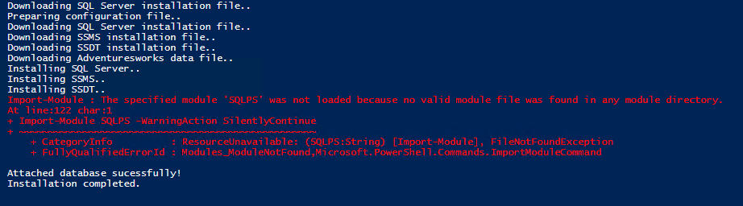

# Applications
The following applications are needed for the training program.

* SQL Server 2016 (Developer Edition)
* SQL Server Management Studio (SSMS)
* SQL Server Data Tools
* Adventureworks Database Sample

## Installing on Windows
To download and install all applications needed on Windows, you may use the attached Powershell script.
The script will also create the following folder structure to organize all installation files and datasets:  
* **c:\colaberry\training\sqlbi\**
* **c:\colaberry\training\sqlbi\installations**
* **c:\colaberry\training\sqlbi\datasets**

***
Note that SQL Server 2016 Server is not compatible with **32 bit machines**, though most of the client tools can be installed on a 32 bit machine. MUST require **64 bit machines** for the Server.
***

### Video walk-through of the installation process
Watch this video for a walk-through of the installation process. 
[](http://www.youtube.com/watch?v=2AOcF88-RtY)

### Downloading and installing all applications

* Download the install_apps.ps1 to a local folder
* Search for "Windows PowerShell ISE" and right click and choose "Run as administrator".
* Click File and then Open and choose the install_apps.ps1 from the local folder
* The file will be normally opened in the top pane and display a blue pane at the bottom
that shows the output of the script when run.
You can also arbitrarily run other commands from the shell.
* Click on the blue pane and enter "Set-ExecutionPolicy RemoteSigned" and click on "yes" when prompted
* Now you can click on green forward (Play) button in the toolbar to run the script. Or just simply press "F5".
You will see the log in the blue pane as the script executes.

---
### Restart may be required
It may require a restart once SQL Server is installed. When prompted, restart the computer and re-run the script. When the script is re-run, you may see the following error (exit message), that just states that all features have been already installed.

>No features were installed during the setup execution. The requested features may already be installed. Please review the summary.txt log for further details
---

### Sample Status Log
Please see the screenshot below for a sample status log. As you can see, some of the intermediate errors while attaching the sample database can be ignored.


### Installing on Windows 7 Machines
SQL Server 2016 can still be installed on Windows 7 64 bit machines. However you may have an older version of Powershell on the machine and in that case, the installation may not succeed. You may see the following error:

```powershell
Method invocation failed because [System.Object[]] doesn't contain a method named 'replac
e'.
At line:109 char:57
At line:109 char:57
+ (Get-Content $setupFolder\ConfigurationFile.ini).replace <<<< ('USERNAMETBR', "$env:com
putername\$env:username") | Set-Content $setupFolder\ConfigurationFile_local.ini
    + CategoryInfo          : InvalidOperation: (replace:String) [], RuntimeException
    + FullyQualifiedErrorId : MethodNotFound
```
To fix this issue, you may follow the Quick Fix mentioned below. If the Quick Fix doesn't work, then you must upgrade the PowerShell version to latest version supported on Windows 7.

#### Quick Fix
* Comment out this line by adding # symbol at the beginning: (Get-Content $setupFolder\ConfigurationFile.ini).replace('USERNAMETBR', "$env:computername\$env:username") | Set-Content $setupFolder\ConfigurationFile_local.ini  
* Replace "USERNAMETBR" with this PC's "UserName\ComputerName" in ConfigurationFile_local.ini file. We do NEED both username and computername along with "\".
* Re-run the script

#### Upgrade Powershell Version
* Install .NET 4.5 FULL version (http://www.microsoft.com/en-us/download/details.aspx?id=30653)
* Install Windows Management Framework (http://www.microsoft.com/en-us/download/details.aspx?id=40855)
* Restart the computer and then
* Run the script again


## Installing on Mac
SQL Server 2016 installation is NOT supported on Mac. You may install Windows on Mac using Parallels Desktop or VMWare Fusion or similar application first and then use the script to install all applications.
